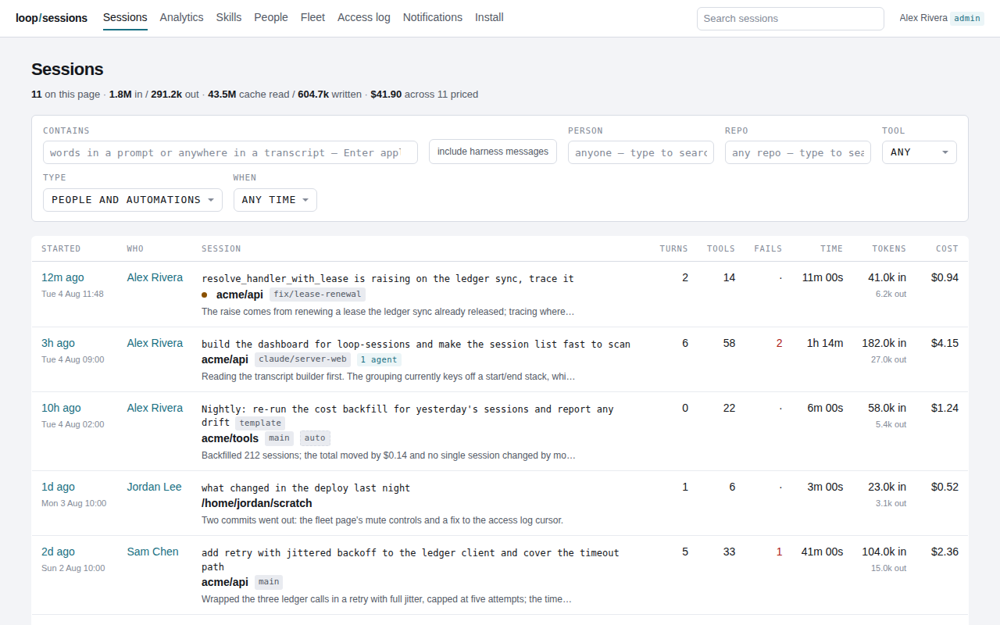
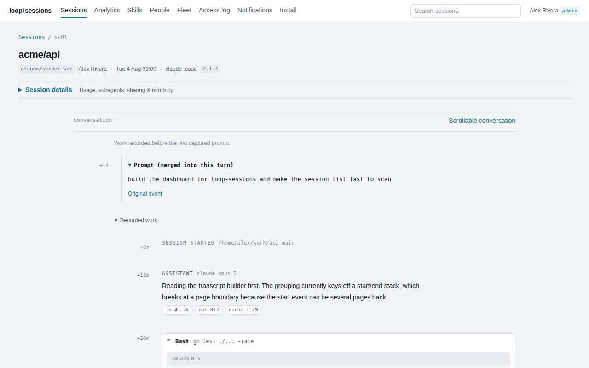
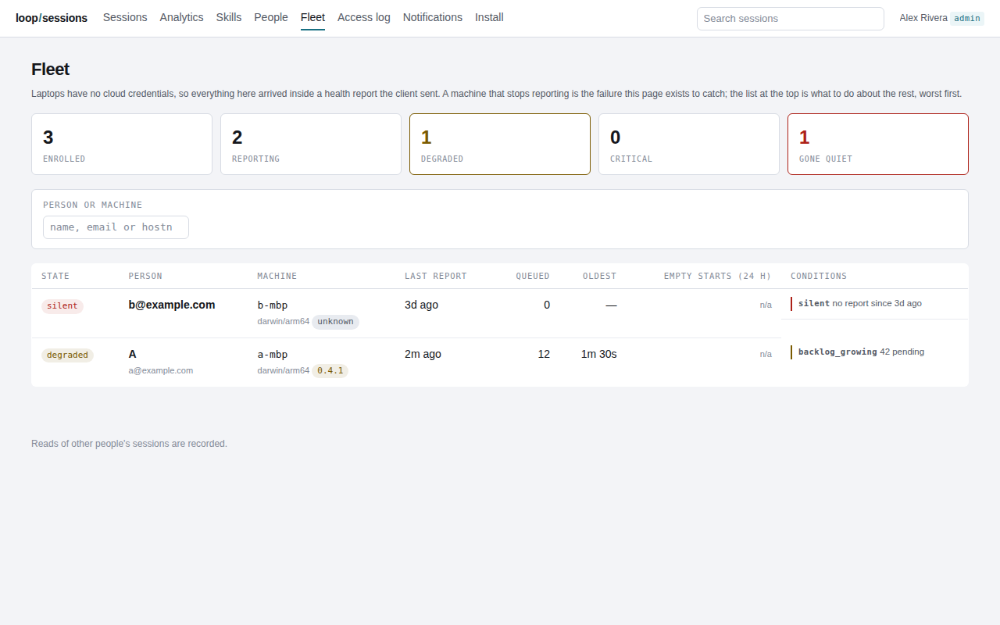
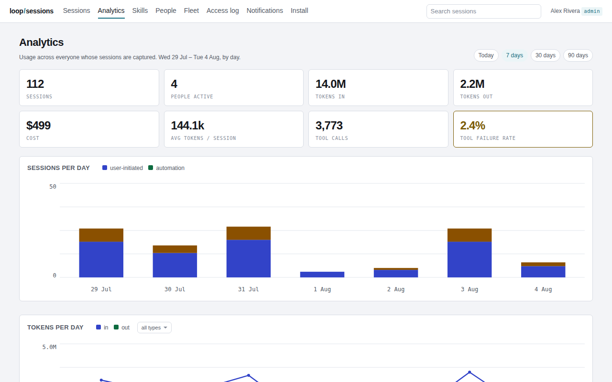

# loop-sessions

loop-sessions collects the AI coding sessions on every engineer's laptop into
one place your organisation runs. A small agent on each machine finds the
session stores that Claude Code and Codex write, captures Claude Code sessions
as they happen, imports the history already on disk, redacts credentials
before anything leaves the machine, and uploads the result to a server you
host. The server keeps it in Postgres and serves a dashboard: the session
list, full transcripts with tool calls and diffs, search, cost, per-skill
usage, and a fleet page that says which laptops are reporting and which are
not.

The product and the binary are `loop-sessions`; the repository is
`agent-sessions`. It is not affiliated with or endorsed by Anthropic.

[](https://github.com/loopai-hq/agent-sessions/actions/workflows/ci.yml)
[](https://github.com/loopai-hq/agent-sessions/actions/workflows/identifier-gate.yml)
[](https://scorecard.dev/viewer/?uri=github.com/loopai-hq/agent-sessions)
[](https://github.com/loopai-hq/agent-sessions/releases)
[](LICENSE)
[](https://pkg.go.dev/github.com/loopai-hq/agent-sessions)

| The session list | One session, with tool calls and diffs |
|---|---|
|  |  |
| **The fleet page** | **Analytics** |
|  |  |

## Try it in five minutes

**1. The dashboard, with nothing but Go.** The dashboard can be served against
fixture sessions, without a database, a Firebase project or a deploy:

```sh
LOOP_WEB_DEMO=:8099 go test ./server/web -run TestServeDemo -timeout 0
```

Open <http://127.0.0.1:8099/sessions>, then `/sessions/s-01`, `/admin/fleet`
and `/analytics`. That is what the screenshots above were taken from. Stop it
with Ctrl-C.

**2. A real server, with Postgres.** You need a Firebase project with Google
sign-in enabled (see [Self-hosting](#self-hosting) for why) and Docker:

```sh
cd examples/docker-compose && cp .env.example .env && $EDITOR .env
docker compose up -d --build && curl -sf http://127.0.0.1:8080/readyz
```

[examples/docker-compose/README.md](examples/docker-compose/README.md) walks
through the three Firebase values, the first admin and the ports. The
published image is `ghcr.io/loopai-hq/loop-sessions-server`.

**3. The agent, on a laptop.** Binaries are on
[GitHub Releases](https://github.com/loopai-hq/agent-sessions/releases); the
installer verifies the SHA-256 before anything is made executable and never
uses `sudo`:

```sh
curl -fsSL https://github.com/loopai-hq/agent-sessions/releases/latest/download/install.sh |
  LOOP_SESSIONS_BASE_URL=https://github.com/loopai-hq/agent-sessions/releases/latest \
  LOOP_SESSIONS_VERSION=download sh
loop-sessions install --endpoint https://sessions.example.com
```

Public binaries carry no server address, so `install` needs `--endpoint`.
[install/README.md](install/README.md) explains every step for someone
deciding whether to trust it, and [docs/RELEASE.md](docs/RELEASE.md#github-releases)
has the pinned-version form and how to verify a release's provenance and
signature. macOS and Linux only: the agent relies on POSIX process control
(signals and a detached process group: `syscall.Kill`, `Setsid`), so Windows
is not supported and the installer refuses to run there.

## Supported harnesses

| Harness | Live capture | Backfill and repair walks | Located by `discover` |
|---|---|---|---|
| Claude Code | yes, through its lifecycle hooks | yes, including subagent and workflow files | yes |
| Codex | no | yes, from its rollouts | yes |
| Claude Desktop, Cursor, Windsurf, Aider, Continue, Gemini CLI | no | no | yes, and reported on the fleet page so you can see what is not covered |

## What leaves the laptop, and what never does

| | Leaves the laptop | Where it goes |
|---|---|---|
| Captured events: prompts, replies, tool calls with their inputs and output, file paths, the working directory, the git branch, diffs, token counts, model names, the harness version | yes, after the scrubber has run | `POST /v1/events` on the server you enrolled with, and nowhere else |
| A health report: hostname, OS and architecture, agent version, uptime, spool and disk counts, which harnesses were found, the agent's own conditions | yes, on a fixed cadence | `POST /v1/health`. It carries no session ids, project paths or prompt text |
| The device token minted at enrolment (`lsd_…`) | yes, as the agent's only credential | the same server. The Firebase token used to sign in is never persisted on the laptop |
| Projects listed in `exclude_paths`, anything captured while paused, files the harness never showed the agent | never | |
| Credentials the scrubber recognises | never: each becomes `[REDACTED:<kind>]` before the event touches the spool | the redaction count travels with the event |

Nothing on the hook path touches the network. Session content leaves the
laptop only through delivery (`POST /v1/events`). The agent's other requests
(the health report, enrolment, the self-upgrade check against `/dl`,
`mirror` and the repair walk's `GET /v1/repair`) go to the same enrolled
server and carry no transcript content. The one third-party contact is the
browser, not the agent: the sign-in page loads the Firebase SDK from
`www.gstatic.com` and `apis.google.com`, and its Content-Security-Policy
names exactly those origins.

Who can read a captured session is what `install` and `status` print: **you
and the server's admins, and a colleague only through a link you share; every
read by anyone but you is logged in the admin access log, and how long
sessions are kept is set by the server operator.** The data inventory, the
audit row and the retention controls are in
[docs/DATA-PROTECTION.md](docs/DATA-PROTECTION.md).

## How this differs from Claude Code's own telemetry

Claude Code's analytics dashboard gives Team and Enterprise admins usage
metrics, pull-request attribution, a leaderboard and a CSV export; it shows no
transcripts. Its OpenTelemetry export emits metrics and events for your own
collector. Prompt text, tool details and tool content are off by default;
with the opt-in flags (`OTEL_LOG_ASSISTANT_RESPONSES`,
`OTEL_LOG_RAW_API_BODIES`) it can send responses and whole API bodies to
that collector, unscrubbed, and only from the moment it was switched on.
loop-sessions keeps the record by default: the transcript itself, scrubbed,
from every laptop in the fleet, plus the history that was on disk before the
agent was installed. It is not a metrics product: there is no Prometheus
endpoint today (see [ROADMAP.md](ROADMAP.md)), and cost is derived from the
captured token counts rather than reported by the harness.

## How it works

On the laptop, `loop-sessions install` registers Claude Code lifecycle hooks
in the harness's own settings file, tagged so they can be removed exactly.
Each hook turns one lifecycle event into canonical events, scrubs them, writes
them to a durable spool and returns; a daemon spawned at session start watches
the harness process and finalises the session when it exits, because a killed
harness fires no end-of-session hook. A separate component drains the spool to
the server, retrying transport failures forever and treating only an explicit
rejection as final.

On the server, `POST /v1/events` answers every item individually and scrubs
each payload a second time, counting what the agent missed. Events are the
durable record; sessions, turns, messages, links and artifacts are derived
from them by a resumable, versioned runner and can be rebuilt at any time.
Authorization is a predicate inside the read, so a session the viewer may not
see and one that does not exist produce byte-identical responses, and a read
of a colleague's session writes its audit row in the same transaction.

For the operator, the fleet page evaluates every enrolled machine from its
health reports and says what to do about the ones that are silent or behind;
retention deletes event bodies and then whole sessions after windows you set;
and the agent upgrades itself from the server it is enrolled with, comparing
digests rather than version numbers so a rollback propagates too. The design
rationale, the codemap and the invariants are in
[docs/ARCHITECTURE.md](docs/ARCHITECTURE.md).

## Self-hosting

**The one hard prerequisite: sign-in is Firebase Authentication with the
Google provider, and nothing else.** The server verifies Firebase ID tokens
against Google's published certificates and calls no other Google API, but
that means you need a Firebase project with Google sign-in enabled, and a
Google account on an allowed domain for every person. There is no OIDC, SAML,
Okta or Entra path today; it is the first item on [ROADMAP.md](ROADMAP.md).

- **Postgres 15 or later.** The first migration uses `NULLS NOT DISTINCT`,
  which does not exist before 15. CI runs the integration suite on 15 and 17.
- **A Firebase project** with Google enabled as a sign-in provider: its project
  id and web API key, and the host in `PUBLIC_URL` on its authorised-domains
  list, or the sign-in popup fails with nothing in the server log.
- **Go 1.26** (`toolchain go1.26.8` in `go.mod`) to build from source, or
  Docker to build the image from the root `Dockerfile`.

The server reads its whole configuration from the environment
(`server/app/config.go`); every missing required variable is reported in one
error at boot. Required:

| Variable | Meaning |
|---|---|
| `DATABASE_HOST` | hostname for TCP, or a directory starting with `/` for a unix socket |
| `DATABASE_NAME`, `DATABASE_USER`, `DATABASE_PASSWORD` | the Postgres role and database |
| `SESSION_KEY` | base64, decoding to at least 32 bytes; signs the dashboard cookie |
| `FIREBASE_PROJECT_ID` | the Firebase project both sign-in surfaces verify against |
| `FIREBASE_API_KEY` | the project's web API key; public by design |
| `ALLOWED_DOMAINS` | comma-separated email domains permitted to sign in |
| `PUBLIC_URL` | the origin people reach the dashboard at; `http://` switches cookies to insecure for local use |

`ALLOWED_DOMAINS` is a coarse gate: any Google account on a listed domain is
enrolled as a member on first sign-in and sees only its own sessions. The
principals roster decides what each person may do, and `ADMIN_EMAILS` is how
the first admin gets there without touching SQL. Every optional variable
(`PORT`, `ADMIN_EMAILS`, retention, the derive window and `TZ`, Slack, the
release bucket, `LOG_LEVEL`) is in
[docs/OPERATIONS.md](docs/OPERATIONS.md#configuration), with the endpoints,
the log contract, backup and restore, upgrade and rollback.

Local development is the same server under `go run`:

```sh
docker run -d --name loop-sessions-pg -e POSTGRES_PASSWORD=postgres \
  -e POSTGRES_DB=loop_sessions -p 5432:5432 postgres:16
export DATABASE_HOST=127.0.0.1 DATABASE_NAME=loop_sessions DATABASE_USER=postgres \
  DATABASE_PASSWORD=postgres SESSION_KEY="$(openssl rand -base64 32)" \
  FIREBASE_PROJECT_ID=__PROJECT__ FIREBASE_API_KEY=your-firebase-web-api-key \
  ALLOWED_DOMAINS=example.com ADMIN_EMAILS=you@example.com PUBLIC_URL=http://127.0.0.1:8080
go run ./server/cmd/loop-sessions-server
make build && ./loop-sessions install --endpoint http://127.0.0.1:8080
```

Use `127.0.0.1`, not `localhost`: the client accepts plain `http://` only to
the loopback literal. Migrations run at boot. The client keeps its state under
`~/.loop/sessions` (or `LOOP_SESSIONS_HOME`).

`examples/deploy-gcp/` is a complete Cloud Run and Cloud SQL deployment with
placeholders, log-based metrics and alert policies, and the BigQuery export;
it is an example, not the only way to run this. The server needs Postgres and
a Firebase project and nothing else.

## Using the client

```
loop-sessions install             set up: find sessions, sign in, start capturing
loop-sessions uninstall           stop capturing and clean up (--purge also deletes captured data waiting to upload)
loop-sessions status              what is being captured and whether it is working (--json)
loop-sessions discover            re-scan this machine for agent session files (--json)
loop-sessions backfill            import the sessions already on this machine
                                  (--since all|30d|2026-07-01, --session <id>, --dry-run)
loop-sessions pause [--for 2h]    stop capturing until resumed, or until the period ends
loop-sessions resume              start capturing again (ends a timed pause early)
loop-sessions doctor              diagnose problems and say how to fix them
                                  (--redrive, --replay-quarantine)
loop-sessions mirror              the Slack mirror from the terminal: list, use <group>, off,
                                  attach <group> [--session <id>], status
loop-sessions version             print the agent version

loop-sessions install --hooks-only   put the capture hooks back without signing in again
loop-sessions daemon --upgrade-now   check the release host now and replace this binary
```

`pause --for 2h` pauses capture and delivery for the period and then resumes
on its own; `status` shows `PAUSED since <t> until <t>` meanwhile. A harness
that `discover` found installed but with no sessions where it looked is a
question, not a verdict: add its directory to `"roots"` in
`~/.loop/sessions/config.json` (`"roots": {"codex": "/path/to/its/sessions"}`)
and run `discover` again. `hook` and `daemon` are invoked by Claude Code and
the installer, not by you; the hook path never returns non-zero and never
writes to stdout, because a hook that errors or chatters degrades the editor.

## Security

Report vulnerabilities as described in [SECURITY.md](SECURITY.md); the trust
boundaries and what a stolen device token can do are in
[docs/THREAT-MODEL.md](docs/THREAT-MODEL.md).

The scrubber (`internal/scrub`) runs on the laptop before an event is written
to the spool. It covers twenty credential kinds (`Kinds` in
`internal/scrub/scrub.go`): SSH and PEM private keys, database passwords in
connection strings, Slack webhooks and tokens, Anthropic, OpenAI, Stripe,
GitHub, AWS and Google keys and tokens, JWTs, `Authorization` headers, this
product's own device tokens, and a generic rule gated on an adjacent
secret-looking key name plus an entropy floor. Over-redaction is treated as a
defect too, since a transcript with every long string blanked is worthless as
a record. The server runs the same rules again on ingest and counts what the
agent missed separately, so a machine whose agent has fallen behind is
visible. The fixtures in `internal/scrub` are synthetic values that match real
key shapes; none was ever issued.

The dashboard is server-rendered with no build step; event archive and
per-event pages ship no JavaScript and carry `script-src 'none'`. Releases are
reproducible from a clean clone at the tag, attested with build provenance
and signed; [docs/RELEASE.md](docs/RELEASE.md#verifying-a-release) has the
three checks.

## AI-assisted development

This repository was written largely with AI coding agents (Claude Code),
driven and reviewed by the maintainers named in [AUTHORS.md](AUTHORS.md);
commits carry the agent's trailer. Every change goes through a pull request,
the test suite and the identifier gate before it is merged, and a human is
accountable for every line. Contributions that use AI are welcome under the
policy in [CONTRIBUTING.md](CONTRIBUTING.md#ai-assisted-contributions).

## Contributing

See [CONTRIBUTING.md](CONTRIBUTING.md) for the build, the code style and what
a change needs before it can merge, [SUPPORT.md](SUPPORT.md) for where to ask,
and [GOVERNANCE.md](GOVERNANCE.md) for how decisions are made. CI runs the
suite with the race detector: the unit suite on Ubuntu and macOS, the
integration suite on Ubuntu against Postgres 15 and 17. This project follows the
[Contributor Covenant](CODE_OF_CONDUCT.md).

## License

MIT. See [LICENSE](LICENSE). Licences of the modules the server links are in
[THIRD_PARTY_NOTICES.md](THIRD_PARTY_NOTICES.md); the agent is standard
library only.
